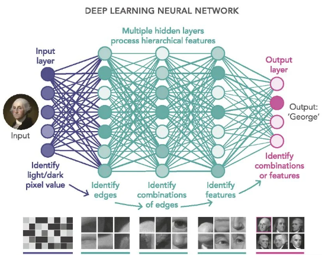
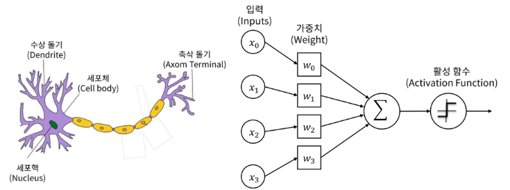
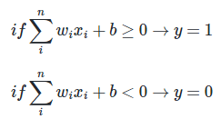
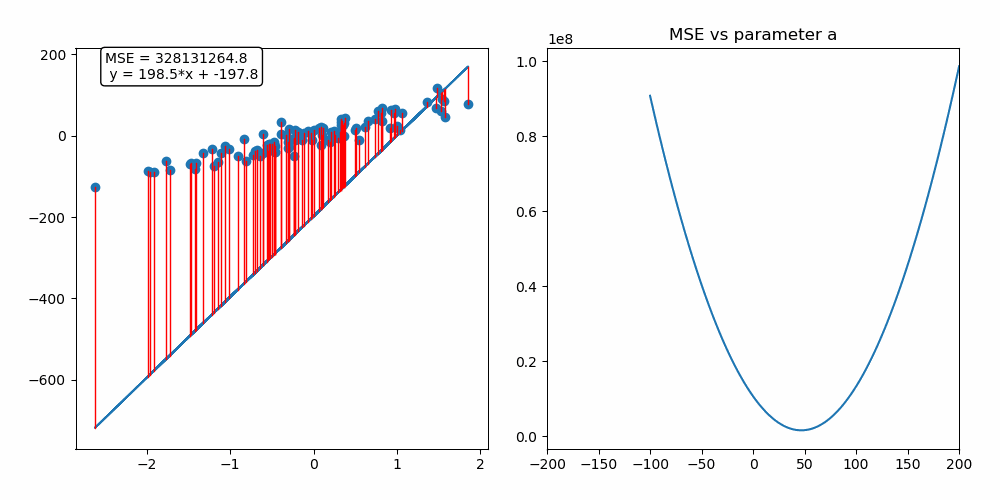
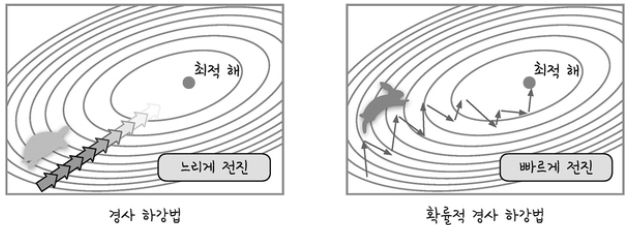
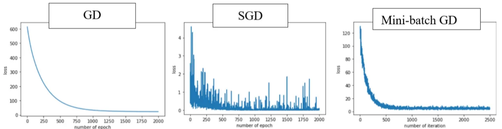
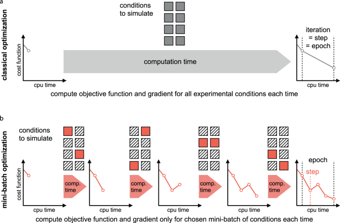

# INTRO
## Ⅰ. Deep Learing (딥러닝)

 

- 인공 신경망(Artificial Neural Network)의 층을 연속적으로 깊게 쌓아올려 데이터를 학습하는 방식을 의미한다.
- 인간이 학습하고 기억하는 매커니즘을 모방한 기계학습이다.
- 인간은 학습 시, 뇌에 있는 뉴런이 자극을 받아들여서 일정 자극 이상이 되면, 화학물질을 통해 다른 뉴런과 연결되며 해당 부분이 발달한다.
- 자극이 약하거나 기준치를 넘지 못하면, 뉴런은 연결되지 않는다.
- 입력한 데이터가 활성 함수에서 임계점을 넘게 되면 출력된다.
- 초기 인공 신경망(Perceptron = 뉴런)에서 깊게 층을 쌓아 학습하는 딥러닝으로 발전한다.
- 딥러닝은 Input nodes layer, Hidden nodes layer, Output nodes layer, 이렇게 세 가지 층이 존재한다.

  
  
  
  
  

# PERCEPTRON
## Ⅰ. SLP
#### 1. SLP (Single Layer Perceptron), 단층 퍼셉트론, 단일 퍼셉트론
가장 단순한 형태의 신경망으로써, Hidden Layer가 없고 Single Layer로 구성되어 있다.  
퍼셉트론의 구조는 입력 features와 가중치, activation function, 출력 값으로 구성되어 있다.

신경 세포에서 신호를 전달하는 축삭돌기의 역할을 퍼셉트론에서는 가중치가 대신하고,  
입력 값과 가중치 값은 모두 인공 뉴런(활성 함수)으로 도착한다.

가중치의 값이 클수록 해당 입력 값이 중요하다는 뜻이고,  
인공 뉴런(활성 함수)에 도착한 각 입력 값이 가중치 값을 곱한 뒤 전체 합한 값을 구한다.

인공 뉴런(활성 함수)는 보통 시그모이드 함수와 같은 계단 함수를 사용하여, 합한 값을 확률로 변환하고  
이 때, 임계치를 기준으로 0 또는 1을 출력한다.

 

 

로지스틱 회귀 모델이 인공 신경망에서는 하나의 인공 뉴런으로 볼 수 있다.  
결과적으로 퍼셉트론은 회귀 모델과 마찬가지로 실제 값과 예측 값의 차이가 최소가 되는 가중치 값을 찾는 과정이 퍼셉트론 학습과정이다.

최초 가중치 값을 설정한 뒤 입력 feature 값으로 예측 값을 계산하고, 실제 값과 차이를 구한 뒤 이를 줄일 수 있도록 가중치 값을 변경한다.

퍼셉트론의 활성화 정도를 편향(bias)으로 조절할 수 있으며, 편향을 통해 어느정도의 자극을 미리 주고 시작할 수 있다.

뉴런이 활성화되기 위해 필요한 자극이 1000이라고 가정하면, 입력 값을 500만 받아도 편향을 2로 주어 10000을 만들 수 있다.

 

    

         
    

    

        
    

 

퍼셉트론의 출력 값과 실제 값의 차이를 줄여나가는 방향성으로 계속해서 가중치 값을 변경하며, 이 때 경사하강법을 사용한다.

 

  
  

#### 2. SGD (Stochastic Gradient Descent), 확률적 경사 하강법
경사 하강법 방식은 전체 학습 데이터를 기반으로 계산한다. 하지만, 입력 데이터가 크고 레이어가 많을 수록 많은 자원이 소모된다.  
일반적으로 메모리 부족으로 인해 연산이 불가능하기 때문에, 이를 극복하기 위해 SGD 방식이 도입되었다.

전체 학습 데이터 중 단 한 건만 임의로 선택하여 경사 하강법을 실시하는 방식을 의미한다.  
많은 건 수 중에 한 건만 실시하기 때문에, 빠르게 최적점을 찾을 수 있지만 노이즈가 심하다.  
무작위로 추출된 샘플 데이터에 대해 경사 하강법을 실시하기 때문에 진폭이 크고 불안정해 보일 수 있다.  
일반적으로 사용되지 않고, SGD를 얘기할 때에는 보통 미니 배치 경사 하강법을 의미한다.

 

  
  

#### 3. Mini-Batch Gradient Descent, 미니 배치 경사 하강법
전체 학습 데이터 중, 특정 크기(Batch 크기)만큼 임의로 선택해서 경사 하강법을 실시한다.  
이 또한, 확률적 경사 하강법이다.

 

 

- 전체 학습 데이터가 1000건이라고 하고, batch size를 100건이라 가정하면,  
  전체 데이터를 batch size만큼 나눠서 가져온 뒤 섞고, 경사하강법을 계산한다.  
  이 경우, 10번 반복해야 1000개의 데이터가 모두 학습되고 이를 epoch라고 한다. 즉, 10 epoch * 100 batch이다.  
*batch size는 제곱에 따라 개수를 정해주면 좋음

 

