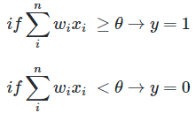
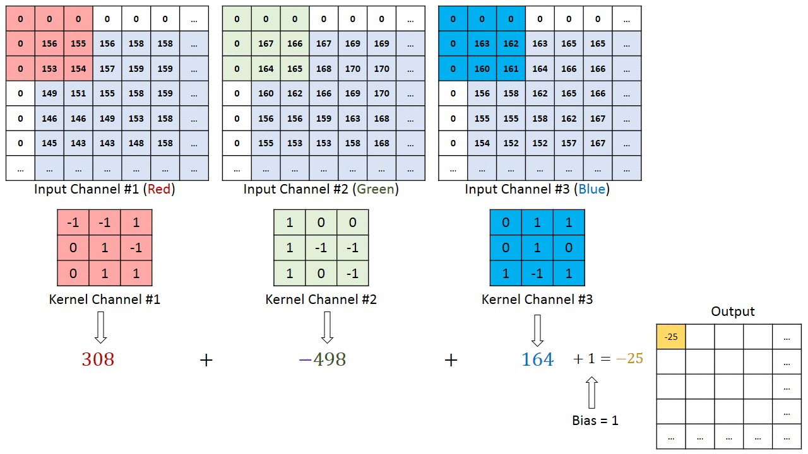
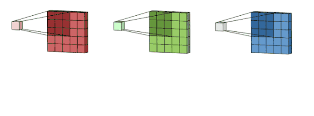
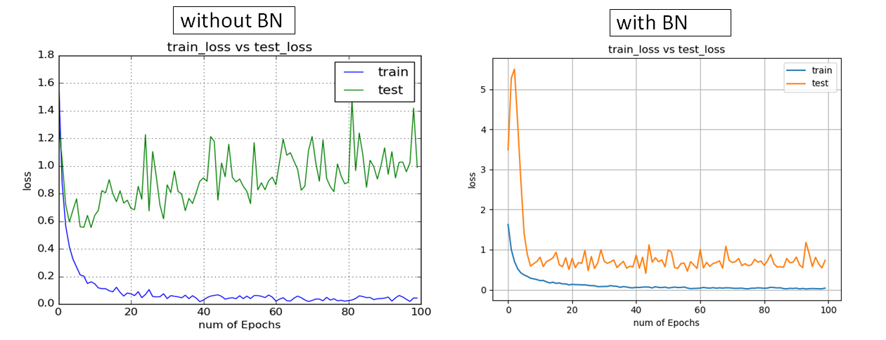
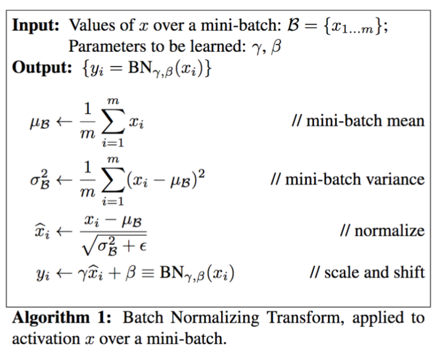
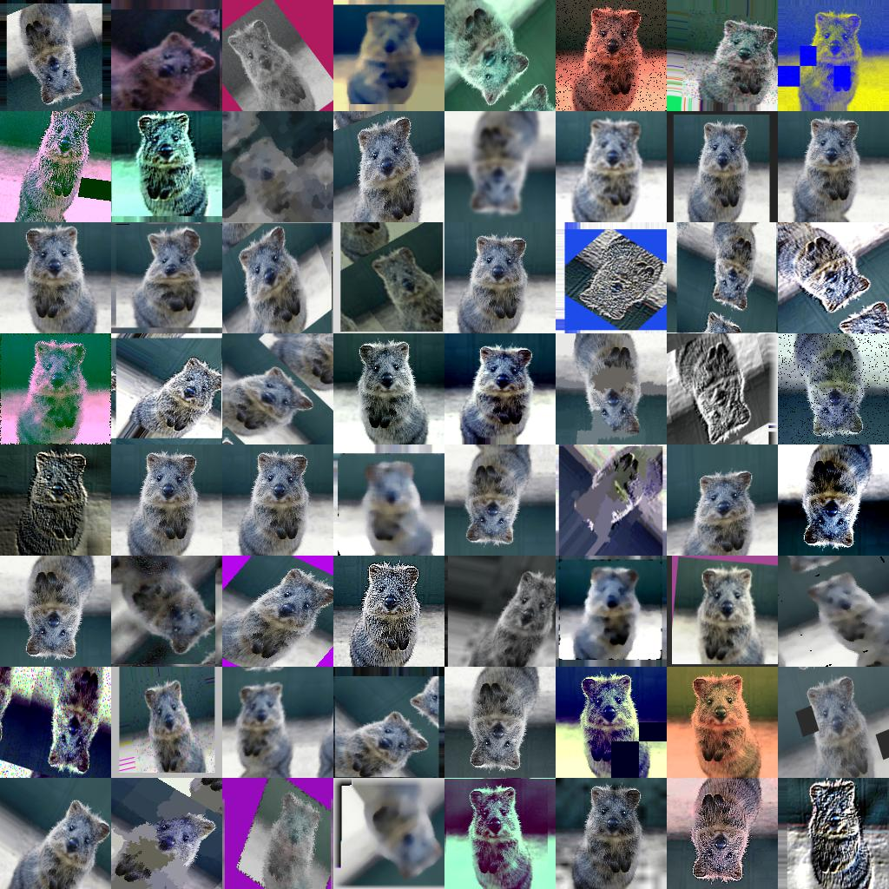
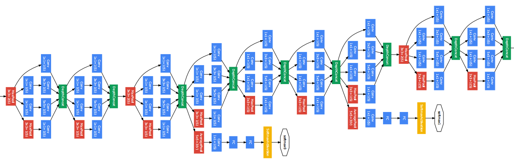

# INTRO
## Ⅰ. Deep Learing (딥러닝)


<br>

- 인공 신경망(Artificial Neural Network)의 층을 연속적으로 깊게 쌓아올려 데이터를 학습하는 방식을 의미한다.
- 인간이 학습하고 기억하는 매커니즘을 모방한 기계학습이다.
- 인간은 학습 시, 뇌에 있는 뉴런이 자극을 받아들여서 일정 자극 이상이 되면, 화학물질을 통해 다른 뉴런과 연결되며 해당 부분이 발달한다.
- 자극이 약하거나 기준치를 넘지 못하면, 뉴런은 연결되지 않는다.
- 입력한 데이터가 활성 함수에서 임계점을 넘게 되면 출력된다.
- 초기 인공 신경망(Perceptron = 뉴런)에서 깊게 층을 쌓아 학습하는 딥러닝으로 발전한다.
- 딥러닝은 Input nodes layer, Hidden nodes layer, Output nodes layer, 이렇게 세 가지 층이 존재한다.

<br></br>
<br></br>
<br></br>
<br></br>
<br></br>

# PERCEPTRON
## Ⅰ. SLP
#### 1. SLP (Single Layer Perceptron), 단층 퍼셉트론, 단일 퍼셉트론
가장 단순한 형태의 신경망으로써, Hidden Layer가 없고 Single Layer로 구성되어 있다.  
퍼셉트론의 구조는 입력 features와 가중치, activation function, 출력 값으로 구성되어 있다.

신경 세포에서 신호를 전달하는 축삭돌기의 역할을 퍼셉트론에서는 가중치가 대신하고,  
입력 값과 가중치 값은 모두 인공 뉴런(활성 함수)으로 도착한다.

가중치의 값이 클수록 해당 입력 값이 중요하다는 뜻이고,  
인공 뉴런(활성 함수)에 도착한 각 입력 값이 가중치 값을 곱한 뒤 전체 합한 값을 구한다.

인공 뉴런(활성 함수)는 보통 시그모이드 함수와 같은 계단 함수를 사용하여, 합한 값을 확률로 변환하고  
이 때, 임계치를 기준으로 0 또는 1을 출력한다.

<br>


<br>

로지스틱 회귀 모델이 인공 신경망에서는 하나의 인공 뉴런으로 볼 수 있다.  
결과적으로 퍼셉트론은 회귀 모델과 마찬가지로 실제 값과 예측 값의 차이가 최소가 되는 가중치 값을 찾는 과정이 퍼셉트론 학습과정이다.

최초 가중치 값을 설정한 뒤 입력 feature 값으로 예측 값을 계산하고, 실제 값과 차이를 구한 뒤 이를 줄일 수 있도록 가중치 값을 변경한다.

퍼셉트론의 활성화 정도를 편향(bias)으로 조절할 수 있으며, 편향을 통해 어느정도의 자극을 미리 주고 시작할 수 있다.

뉴런이 활성화되기 위해 필요한 자극이 1000이라고 가정하면, 입력 값을 500만 받아도 편향을 2로 주어 10000을 만들 수 있다.

<br>

<div style="display: flex; width: 500px; margin-left: 20px;">
    <div style="width: 200px;">
         
    </div>
    <div style="width: 225px">
        
    </div>
</div>

<br>

퍼셉트론의 출력 값과 실제 값의 차이를 줄여나가는 방향성으로 계속해서 가중치 값을 변경하며, 이 때 경사하강법을 사용한다.

<br>


<br></br>
<br></br>

#### 2. SGD (Stochastic Gradient Descent), 확률적 경사 하강법
경사 하강법 방식은 전체 학습 데이터를 기반으로 계산한다. 하지만, 입력 데이터가 크고 레이어가 많을 수록 많은 자원이 소모된다.  
일반적으로 메모리 부족으로 인해 연산이 불가능하기 때문에, 이를 극복하기 위해 SGD 방식이 도입되었다.

전체 학습 데이터 중 단 한 건만 임의로 선택하여 경사 하강법을 실시하는 방식을 의미한다.  
많은 건 수 중에 한 건만 실시하기 때문에, 빠르게 최적점을 찾을 수 있지만 노이즈가 심하다.  
무작위로 추출된 샘플 데이터에 대해 경사 하강법을 실시하기 때문에 진폭이 크고 불안정해 보일 수 있다.  
일반적으로 사용되지 않고, SGD를 얘기할 때에는 보통 미니 배치 경사 하강법을 의미한다.

<br>


<br></br>
<br></br>

#### 3. Mini-Batch Gradient Descent, 미니 배치 경사 하강법
전체 학습 데이터 중, 특정 크기(Batch 크기)만큼 임의로 선택해서 경사 하강법을 실시한다.  
이 또한, 확률적 경사 하강법이다.

<br>


<br>

- 전체 학습 데이터가 1000건이라고 하고, batch size를 100건이라 가정하면,  
  전체 데이터를 batch size만큼 나눠서 가져온 뒤 섞고, 경사하강법을 계산한다.  
  이 경우, 10번 반복해야 1000개의 데이터가 모두 학습되고 이를 epoch라고 한다. 즉, 10 epoch * 100 batch이다.  
<sub>*batch size는 제곱에 따라 개수를 정해주면 좋음</sub>

<br>


<br></br>
<br></br>
<br></br>

## Ⅱ. MLP
### 1. Multi Layer Perceptron, 다층 퍼셉트론, 다중 퍼셉트론
보다 복잡한 문제의 해결을 위해서 입력층과 출력층 사이에 은닉층이 포함되어 있다.  
퍼셉트론을 여러층 쌓은 인공 신경망으로서, 각 층에서는 활성함수를 통해 입력을 처리한다.  
층이 깊어질 수록 정확한 분류가 가능해지지만, 너무 깊어지면 Overfitting이 발생한다.

<div style="display: flex">
    <div>
        
    </div>
    <div>
        
    </div>
</div>

<br></br>
<br></br>

### 2. ANN (Artificial Neural Network), 인공 신경망
은닉층이 1개일 경우 이를 인공 신경망이라고 한다.

<br>


<br></br>
<br></br>

### 3. DNN (Deep Neural Network), 심층 신경망
은닉층이 2개 이상일 경우 이를 심층 신경망이라고 한다.

<br>


<br></br>
<br></br>

### 4. BackPropagation, 역전파
심층 신경망에서 최종 출력(예측)을 하기 위한 식이 생기지만, 식이 너무 복잡해지기 때문에 편미분을 진행하기에 한계가 있다.

즉, 편미분을 통해 가중치 값을 구하고, 경사 하강법을 통해 가중치 값을 업데이트하며, 손실 함수의 최소 값을 찾아야 하는데,  
순방향으로는 복잡한 미분식을 계산할 수가 없다. 따라서, 미분의 연쇄 법칙(Chain Rule)을 사용하여 역방향으로 편미분을 진행한다.

<br></br>

#### 4-1. 합성 함수의 미분
  

<br>

---

<br>


<br>

 

<br> 

 

<br>

  

<br></br>
<br></br>
<br></br>

## Ⅲ. Activation Function
### 1. Activation Function, 활성화 함수
인공 신경망에서 입력 값에 가중치를 곱한 뒤 합한 결과를 적용하는 함수이다.

<br>

---

<br>

#### 1-1. sigmoid, 시그모이드 함수 (이진분류)
은닉층이 아닌 최종 활성화 함수. 즉, 출력층에서 사용된다.  
은닉에서 사용 시, 입력 값이 양의 방향으로 큰 값일 경우 출력 값의 변화가 없으며, 음의 방향도 마찬가지이다.  
평균이 0이 아니기 때문에 정규 분포 형태가 아니고, 이는 방향에 따라 기울기가 달라져서 탐색 경로가 비효율적(지그재그)이 된다.

<br>


<br></br>

#### 1-2. softmax, 소프트맥스 함수 (다중분류)
은닉층이 아닌 최종 활성화 함수(출력층)에서 사용된다.  
시그모이드와 유사하게 0 ~ 1 사이의 값을 출력하지만, 이진 분류가 아닌 다중 분류를 통해 모든 확률 값이 1이 되도록 해준다.  
여러 개의 타겟 데이터를 분류하는 다중 분류의 최종 활성화 함수(출력층)로 사용된다.

<br>


<br></br>

#### 1-3. tangent, 탄젠트 함수
은닉층이 아닌 최종 활성화 함수(출력층)에서 사용된다.  
은닉층에서 사용 시, 시그모이드와 달리 -1 ~1 사이의 값을 출력해서 평균이 0이 될 수 있지만,  
여전히 입력 값의 양의 방향으로 큰 값일 경우 출력값의 변화가 미비하고 음의 방향도 마찬가지이다.

<br>


<br></br>

#### 1-4. relu, 렐루 함수
대표적인 은닉층의 활성 함수이다.  
입력 값이 0보다 작으면 출력은 0이 되고, 0 보다 크면 입력값을 그대로 출력하게 된다.  
<sub>*max(0, input) = 최대값을 구해주는 함수, 음수가 나오면 안 되고, 음수 부분은 0으로 취급함</sub>

<br>


<br></br>
<br></br>

### 2. Cross Entropy (손실 함수)
실제 데이터의 확률 분포와, 학습된 모델이 계산한 확률 분포의 차이를 구하는데 사용된다.  
분류 문제에서 원-핫 인코딩을 통해 사용할 수 있는 오차 계산법이다.  
<sub>각 샘플에 대해 교차 엔트로피를 계산하고, 모두 더해서 평균을 내면 모델의 손실 값이 됨</sub>

<br>


<br></br>
<br></br>
<br></br>

## Ⅳ. Optimizer
### 1. Optimizer, 최적화
최적의 경사 하강법을 적용하기 위해 필요하며, 최솟값을 찾아가는 방법들을 의미한다.  
loss를 줄이는 방향으로 최소 loss를 보다 빠르고 안정적으로 수렴할 수 있어야 한다.

<br>


<br></br>

#### 1-1. Momentum
가중치를 계속 업데이트할 때마다 이전의 값을 일정 수준 반영시키면서 새로운 가중치로 업데이트한다.  
지역 최소값에서 벗어나지 못하는 문제를 해결할 수 있으며, 진행했던 방향만큼 추가적으로 더하여, 관성처럼 빠져나올 수 있게 해준다.

<br>


<br></br>

#### 1-2. AdaGrad (Adaptive Gradient)
가중치 별로 서로 다른 학습률을 동적으로 적용한다.  
적게 변화된 가중치는 보다 큰 학습률을 적용하고, 많이 변화된 가중치는 보다 작은 학습률을 적용시킨다.  
처음에는 큰 보폭으로 이동하다가 최소값에 가까워질 수록 작은 보폭으로 이동하게 된다.  
과거의 모든 기울기를 사용하기 때문에 학습률이 급격히 감소하여, 분모가 커짐으로써 학습률이 0에 가까워지는 문제가 있다.

<br>

<div style="display: flex">
    <div>
        
    </div>
    <div>
        
    </div>
</div>

<br></br>

#### 1-3. RMSProp (Root Mean Sqaure Propagation)
AdaGrad의 단점을 보완한 기법으로서, 학습률이 지나치게 작아지는 것을 막기 위해 지수 가중 평균법(exponentially weighted average)을 통해 구한다.  
지수 가중 평균법이란, 데이터의 이동 평균을 구할 때 오래된 데이터가 미치는 영향을 지수적으로 감쇠하도록 하는 방법이다.  
이전의 기울기들을 똑같이 더해가는 것이 아니라 훨씬 이전의 기울기는 조금 반영하고 최근의 기울기를 많이 반영한다.  
<sub>*과거의 것을 약하게, 최근의 것을 강하게 함(직전의 영향력이 크다)</sub>

feature마다 적절한 학습률을 적용하여 효율적인 학습을 진행할 수 있고, AdaGrad보다 학습을 오래 할 수 있다.

<br></br>

#### 1-4. Adam (Adaptive Moment Estimation)
Momentum과 RMSProp 두 가지 방식을 결합한 형태로서, 진행하던 속도에 관성을 주고, 지수 가중 평균법을 적용한 알고리즘이다.  
최적화 방법 중에서 가장 많이 사용되는 알고리즘이며, 수식은 아래와 같다.

<br>

<div style="display: flex">
    <div>
        
    </div>
    <div>
        
    </div>
</div>

<br></br>
<br></br>
<br></br>
<br></br>
<br></br>

# TENSORFLOW
## Ⅰ. tensorflow
### 1. Tensorflow, 텐서플로우
구글이 개발한 오픈소스 소프트웨어 라이브러리이며, 머신러닝과 딥러닝을 쉽게 사용할 수 있도록 다양한 기능을 제공한다.  
주로 이미지 인식이나 반복 신경망 구성, 기계 번역, 필기 숫자 반별 등을 위한 각종 신경망 학습에 사용된다.  
딥러닝 모델을 만들 때, 기초부터 세세하게 작업해야 하기 때문에 진입장벽이 높다.

<br>


<br></br>
<br></br>

### 2. Keras, 케라스
일반 사용 사례에 "최적화, 간단, 일관, 단순화"된 인터페이스를 제공한다.  
손쉽게 딥러닝 모델을 개발하고 활용할 수 있도록 직관적인 API를 제공한다.  
텐서플로우 2버전 이상부터 케라스가 포함되었기 때문에 텐서플로우를 통해 케라스를 사용한다.  
기존 Keras 패키지보다는 이제 Tensorflow에 내장된 Keras 사용이 더 권장된다.

<br>


<br></br>
<br></br>

### 3. Grayscale, RGB
흑백 이미지와 컬러 이미지는 각 2차원과 3차원으로 표현될 수 있다.  
흑백 이미지는 0 ~ 255를 갖는 2차원 배열(높이 × 너비)이고,  
컬러 이미지는 0 ~ 255를 갖는 R, G, B 2차원 배열 3개를 갖는 3차원 배열(높이 × 너비 × 채널)이다.  
<sub>*흑백은 색상 정보를 포함하지 않기 때문에 2차원 배열임</sub>

<br>

<div style="display: flex; margin-top:20px;">
    <div>
        
    </div>
    <div>
        
    </div>
</div>

<br></br>

#### 3-1. Grayscale Image Matrix
검은색에 가까운 색은 0에 가깝고 흰색에 가까우면 255에 가깝다.  
 **모든 픽셀이 feature이다.**  
<sub>*따라서, Flatten을 통해 input으로 넣을 수 있음</sub>  
<sub>*Grayscale은 회색을 기점으로 작은지 큰지를 보며, 작으면 검은색, 크면 흰색으로 인식한다.</sub>

<br>


<br></br>
<br></br>
<br></br>

## Ⅱ. keras
### 1. Sequential API, Functional API
#### 1-1. Sequential API (단순한것)
간단한 모델을 구현하기에 적합하고 단순하게 층을 쌓는 방식으로 쉽고 사용하기가 간단한다.  
단일 입력 및 출력만 있으므로 레이어를 공유하거나 여러 입력 또는 출력을 가질 수 있는 모델을 생성할 수 없다.  
<sub>Sequential은 대괄호로 열어야 하며, 제어문이 사용이 불가하다.</sub>

<br></br>

#### 1-2. Functional API (복잡한것, 단 단순한것도 functional로도 사용함)
Functional API는 Sequential API로는 구현하기 어려운 복잡한 모델들을 구현할 수 있다.  
여러 개의 입력 및 출력을 가진 모델을 구현하거나 층 간의 연결 및 연산을 수행하는 모델 구현 시 사용한다.  
<sub>Functional은 내놓고 사용하며, 제어문 결합이 가능하고 상황에 따라 튜닝이 가능하다.</sub>

<br></br>
<br></br>

### 2. 성능 평가


<br></br>

#### 2-1. Performance estimation (사전에 생성된 모델을 사용할 때)
1. Large dataset
    - 큰 데이터 세트에서는 그표준대로 사용

2. Small dataset
    - 작은 데이터 세트는 데이터가 적기 때문에 20%만 가져와서 하기 힘들기 때문에,  
      100개라고 가정할 때 99개는 훈련시키고 1개를 랜덤으로 뽑아와서 검증으로 사용
    - 작은 데이터 세트에서는 반복해서 데이터 훈련을 할 수 있도록 하고,  
      0.632(+) bootstrap이라는 이름의 부트스트랩을 사용해서 진행 (더 훈련할 수 있게 반복하는 것)

<br></br>

##### 2-2.  Model selection and performance estimation (하이퍼 파라미터 오티마제이션)
1. Large dataset
    - 하이퍼 파라미터를 최적화할 수 있고 데이터개수가 많다면, (train/validatino/test split) 세가지로 분리

2. Small dataset
    - 작은 데이터 세트는 데이터가 적기 때문에 20%만 가져와서 하기 힘들기 때문에,  
      100개라고 가정할 때 99개는 훈련시키고 1개를 랜덤으로 뽑아와서 검증으로 사용

<br></br>
<br></br>
<br></br>

## Ⅲ. callback
### 1. Callback API
모델이 학습 중에 충돌이 발생하거나 네트워크가 끊기면, 모든 훈련 시간이 낭비될 수 있고,  
과적합을 방지하기 위해 훈련을 중간에 중지해야 할 수도 있다.  

모델이 학습을 시작하면 학습이 완료될 때까지 아무런 제어를 하지 못하게 되고,  
  신경망 훈련을 완료하는 데에는 몇 시간 또는 며칠이 걸릴 수 있기 때문에 모델을 모니터링하고 제어할 수 있는 기능이 필요하다.
훈련 시(fit()) Callback API를 등록시키면 반복 내에서 특정 이벤트 발생마다 등록된 callback이 호출되어 수행된다.

<br></br>

#### 1-1. ModelCheckpoint

```
ModelCheckpoint(filepath, monitor='val_loss', verbose=0, save_best_only=False, save_weight_only=False, mode='auto')
```

<br>

특정 조건에 따라서 모델 또는 가중치를 파일로 저장한다.  

- filepath: "weights.{epoch:03d}-{val_loss:.4f}-{acc:.4f}.weights.h5"와 같이 모델의 체크포인트를 저장한다.
- monitor: 모니터링할 성능 지표를 작성한다.
- save_best_only: 가장 좋은 성능을 나타내는 모델을 저장할 지에 대한 여부
- save_weights_only: weights만 저장할 지에 대한 여부
- mode: {auto, min, max} 중 한 가지를 작성한다. monitor의 성능 지표에 따라 좋은 경우를 선택한다.  
<sub>*monitor의 성능 지표가 감소해야 좋은 경우 min, 증가해야 좋은 경우 max, monitor의 이름으로부터 자동으로 유추하고 싶다면 auto</sub>

<br>

<sub>*epoch:03d = 3자리 정수로 자리를 맞추기, 0 붙이면 앞에 공백을 맞춘다 (001, 010, 100 ...) </sub>  
<sub>*확장자는 반드시 weights.h5를 한번에 작성해야 함 (확장자만 작성 불가)</sub>  
<sub>*monitor와 mode는 같이 가는 개념, monitor에 loss 값을 구해야 하면 mode에는 min, acc면 max, auto도 가능하나 잘 사용하지 않음</sub>

<br></br>

#### 1-2. ReduceLROnPlateau

```
ReduceLROnPlateau(monitor='val_loss', factor=0.1, patience=10, verbose=0, mode='auto', min_lr=0)
```
<br>

특정 반복동안 성능이 개선되지 않을 때, 학습률을 동적으로 감소시킨다.  

- monitor: 모니터링할 성능 지표를 작성한다.
- factor: 학습률을 감소시킬 비율, 새로운 학습률 = 기존 학습률 * factor
- patience: 학습률을 줄이기 전에 monitor할 반복 횟수
- mode: {auto, min, max} 중 한 가지를 작성한다. monitor의 성능 지표에 따라 좋은 경우를 선택한다.  
<sub>*monitor의 성능 지표가 감소해야 좋은 경우 min, 증가해야 좋은 경우 max, monitor의 이름으로부터 자동으로 유추하고 싶다면 auto</sub>

<br></br>

#### 1-3. EarlyStopping
```
EarlyStopping(monitor='val_loss', patience=0, verbose=0, mode='auto')
```

<br>

 특정 반복동안 성능이 개선되지 않을 때, 학습을 조기에 중단한다.

- monitor: 모니터링할 성능 지표를 작성한다.
- patience: Early Stopping을 적용하기 전에 monitor할 반복 횟수.
- mode: {auto, min, max} 중 한 가지를 작성한다. monitor의 성능 지표에 따라 좋은 경우를 선택한다.  
<sub>*monitor의 성능 지표가 감소해야 좋은 경우 min, 증가해야 좋은 경우 max, monitor의 이름으로부터 자동으로 유추하고 싶다면 auto</sub>

<br></br>
<br></br>
<br></br>
<br></br>
<br></br>

# CNN
## Ⅰ. CNN
### 1. CNN (Convolutional Neural Network), 합성곱 신경망
실제 이미지 데이터는 분류 대상이 이미지에서 고정된 위치에 있지 않은 경우가 대부분이다.  
실제 이미지 데이터를 분류하기 위해서는, 이미지의 각 feature들을 그대로 학습하는 것이 아닌, CNN으로 패턴을 인식한 뒤 학습해야 한다.  
<sub>* CNN은 input 전 학습하며, 은닉층이다.</sub>

<br>

<div style="display: flex; width:70%; margin-bottom: 30px;">
    <div>
        
    </div>
    <div>
        
    </div>
</div>

<br>

이미지의 크기가 커질 수록 굉장히 많은 Weight가 필요하기 때문에 분류기에 바로 넣지 않고, 이를 사전에 추출 및 축소해야 한다.  
CNN은 인간의 시신경 구조를 모방한 기술로서, 이미지의 패턴을 찾을 때 사용한다.  
Feature Extraction을 통해 각 단계를 거치면서, 함축된 이미지 조각으로 분리되고 각 이미지 조각을 통해 이미지의 패턴을 인식한다.  
<sub>* 오른쪽 이미지는 학습 시 전체 픽셀을 진행할 필요가 없어 패턴을 분석시켜 진행한다.<br>
눈, 코, 입 등 부분만 가져와 줄여나가면 왼쪽 이미지처럼 이미지가 모이는데 그걸 input으로 넣어 사용한다.</sub>

<br>


<br>

CNN은 분류하기에 적합한 최적의 featrue를 추출하고, 최적의 feature를 추출하기 위한 최적의 Weight와 Filter를 계산한다.

<br>


<br></br>

#### 1-1. Filter
보통 정방 행렬로 구성되어 있고, 원본 이미지에 슬라이딩 윈도우 알고리즘을 사용하여 순차적으로 새로운 픽셀값을 만들면서 적용한다.  
사용자가 목적에 맞는 특정 필터를 만들거나 기존에 설계된 다양한 필터를 선택하여 이미지에 적용한다.  
하지만, CNN은 최적의 필드값을 학습하여 스스로 최적화한다.

<br>


<br>

필터 하나 당, 이미지의 채널 수 만큼 Kernel이 존재하고, 각 채널에 할당된 필터의 커널을 적용하여 출력 이미지를 생성한다.  
출력 feature map(=활성화 함수)의 개수는 필터의 개수와 동일하다.  
<sub>*내가 사용하는 필터의 개수는 아웃풋의 개수이다.<br>
*필터의 개수는 bias(편향)으로 들어간다.<br>
*커널의 크기는 커널만의 사이즈가 있다.<br>
*필터는 항상 채널의 수와 동일하다.<br>
*epoch=필터, batch=채널</sub>

<br>



<br></br>

#### 1-2. Kernel
filter 안에 1 ~ n 개의 커널이 존재한다. 커널의 개수는 반드시 이미지의 채널 수와 동일해야 한다.  
Kernel Size는 가로 X 세로를 의미하며, 가로와 세로는 서로 다를 수 있지만 보통은 일치시킨다.  
Kernel Size가 크면 클 수록 입력 이미지에서 더 많은 feature 정보를 가져올 수 있지만,  
큰 사이즈의 Kernel로 Convolution Backbone을 할 경우 훨씬 더 많은 연산량과 파라미터가 필요하다.  
<sub>*채널은 tuple 또는 정수로 전달이 가능한데, 정방이면 정수를 사용하고 아니라면 tuple을 사용한다.</sub>

<br>



<br></br>

#### 1-3. Stride
입력 이미지에 Convolution Filter를 적용할 때 Sliding Window가 이동하는 간격을 의미한다.  
기본 stride는 1이지만, 2를 적용하면 입력 feature map 대비 출력 feature map의 크기가 절반정도 줄어든다.  
stride를 키우면 feature 정보를 손실할 가능성이 높아지지만,  
오히려 불필요한 특성을 제거하는 효과를 가져올 수 있고 Convolution 연산 속도를 향상 시킨다.  
<sub>*크기를 줄이고 싶다면, Stride를 높이면 된다.</sub>

<br>

<div style="display: flex; width:70%; margin-top: 10px;">
    <div>
        
    </div>
    <div>
        
    </div>
</div>

<br></br>

#### 1-4. Padding
Filter를 적용하여 Convolution 수행 시 출력 feature map이 입력 feature map 대비 계속해서 작아지는 것을 막기 위해 사용한다.  
Filter 적용 전, 입력 feature map의 상하좌우 끝에 각각 열과 행을 추가한 뒤, 0으로 채워서 크기를 증가시킨다.  
출력 이미지의 크기를 입력 이미지의 크기와 동일하게 유지하기 위해서 직접 계산할 필요 없이 "same"이라는 값을 통해 입력 이미지의 크기와 동일하게 맞출 수 있다.

<br>


<br></br>

#### 1-5. Pooling
Convolution이 적용된 feature map의 일정 영역별로 하나의 값을 추출하여 feature map의 사이즈를 줄인다.  
보통은 Convolution -> Relu activation -> Pooling 순서로 적용한다.  

비슷한 feature들이 서로 다른 이미지에서 위치가 달라지면서 다르게 해석되는 현상을 중화시킬 수 있고,  
feature map의 크기가 줄어들기 때문에, 연산 성능이 향상된다.  

Max Pooling과 Average Pooling이 있으며, Max Pooling은 중요도가 가장 높은 feature를 추출하고, Average Pooling은 전체를 버무려서 추출한다.  
<sub>*Max Pooling으로는 위치만 달라져있는 달 위치 등을 찾는데 좋다.<br>
*예를들어, 국기를 Average를 사용하여 평균을 내버리면, 빨강 + 파랑의 평균값 보라색으로 결론을 내기 때문에 문제가 발생할 수 있다.<br>
*실전에서는 weight 값의 중요에 따라 결정된다.<br>
*Max와 Average를 비교했을 때, 성능이 Max가 더 좋아 Max를 더 많이 사용하는데, 상황에 따라 Average를 사용한다.<br>
하지만, Max와 Average보다는 Stride를 더 많이 사용한다.</sub>

<br>


<br></br>
<br></br>

### 2. 정리
Stride를 증가시키는 것과 Pooling을 적용하는 것은 출력 feature map의 크기를 줄이는 데 사용하는 것이다.

Convolution 연산을 진행하면서, feature map의 크기를 줄이면, 위치 변화에 따른 feature의 영향도도 줄어들기 때문에 과적합을 방지할 수 있는 장점이 있다.

Pooling의 경우 특정 위치의 feature 값이 손실되는 이슈 등으로 인하여 최근 Advanced CNN에서는 많이 사용되지 않는다.

Classifier에서는 Fully Connected Layer의 지나친 연결로 인해 많은 파라미터가 생성되므로 오히려 과적합이 발생할 수 있다.

<br>


<br>

Dropout을 사용해서 Layer간 연결을 줄일 수 있으며 과적합을 방지할 수 있다.

<br>


<br></br>
<br></br>
<br></br>

## Ⅱ. CNN PERFORMANCE
### 1. CNN Performance
CNN 모델을 제작할 때, 다양한 기법을 통해 성능 개선 및 과적합 개선이 가능하다.  
<sub>*모델을 생성하기 전이 전처리 과정이며,  
해당 부분은 모델 생성 시 진행되는 과정으로 퍼포먼스라고 칭한다(전처리라고 보기에 무리가 있음).</sub>

<br></br>

#### 1-1. Weight Initialization, 가중치 초기화
처음 가중치를 어떻게 줄 것인지를 정하는 방법이며, 처음 가중치를 어떻게 설정하느냐에 따라 모델의 성능이 크게 달라질 수 있다.  
<sub>*가중치를 최초 한번만 초기화 하다보니 점점 층을 타면서 흐트러지는 문제가 발생한다.  
활성화 함수를 타고 갈 때 결과 값으로 가중치가 결정이 되고 filter로 output의 개수가 나오며 가중치가 흐트러진다.  
히를 하면 매번 초기화를 해주기 때문에 분포가 맞아간다.  
따라서, 중간에 히를 사용하고 마지막 출력에서 글로로트를 사용해야 한다.</sub>

<br>

1. 사비에르 글로로트 초기화  
고정된 표준편차를 사용하지 않고, 이전 층의 노드 수에 맞게 현재 층의 가중치를 초기화한다.  
층마다 노드 개수를 다르게 설정하더라도 이에 맞게 가중치가 초기화되기 때문에 고정된 표준편차를 사용하는 것보다 이상치에 민감하지 않다.  
활성화 함수가 ReLU일 때, 층이 지날 수록 활성화 값이 고르지 못하게 되는 문제가 생겨서, 출력층에서만 사용한다.

<br>

<div style="display: flex;">
    <div>
        
    </div>
    <div>
        
    </div>
</div>  

<br></br>

2. 카이밍 히 초기화
고정된 표준편차를 사용하지 않고, 이전 층의 노드 수에 맞게 현재 층의 가중치를 초기화한다.  
층마다 노드 개수를 다르게 설정하더라도 이에 맞게 가중치가 초기화되기 때문에 고정된 표준편차를 사용하는 것보다 이상치에 민감하지 않다.  
활성화 함수가 ReLU일 때, 추천하는 초기화 방법으로서, 층이 깊어지더라도 모든 활성값이 고르게 분포된다.

<br>


<br></br>

#### 1-2. Batch Normalization, 배치 정규화
입력 데이터 간에 값의 차이가 발생하면, 가중치의 비중도 달라지기 때문에 층을 통과할 수록 편차가 심해진다.  
이를 내부 공변량 이동(Internal Convariant Shift)이라고 한다.

가중치의 값의 비중이 달라지면, 특정 가중치에 중점을 두면서 경사 하강법이 진행되기 때문에,  
모든 입력값을 표준 정규화하여 최적의 parameter를 보다 빠르게 학습할 수 있도록 해야한다.

가중치를 초기화할 때 민감도를 감소시키고, 학습 속도 증가시키며, 모델을 일반화하기 위해서 사용한다.

<br>

<div style="display: flex; width: 90%;">
    <div>
        
    </div>
    <div>
        
    </div>
</div>

<br>

BN은 activation function 앞에 적용하면, weight 값은 평균이 0, 분산이 1인 상태로 정규분포가 된다.

ReLU가 activation으로 적용되면 음수에 해당하는(절반 정도) 부분이 0이 된다.  
이러한 문제를 해결하기 위해서 γ(감마)와 β(베타)를 사용해서 음수부분이 모두 0이 되는 것을 막아준다.

<br>

<div style="display: flex; width: 70%;">
    <div>
        
    </div>
    <div>
        
    </div>
</div>

<br></br>

#### 1-3. Batch Size
batch size를 작게 하면, 적절한 noise가 생겨서 overfitting을 방지하게 되고, 모델의 성능을 향상시키는 계기가 될 수 있지만, 너무 작아서는 안된다.  
batch size를 너무 작게 하는 경우에는 batch당 sample 수가 작아져서 훈련 데이터를 학습하는 데에 부족할 수 있다.  
따라서 굉장히 크게 주는 것 보다는 작게 주는 것이 좋으며, 이를 또 너무 작게 주어서는 안된다.  
  **논문에 따르면 8보다 크고 32보다 작게 주는 것이 효과적이라고 한다(상황에 따라 다름).**

<br>

<div style="display: flex; width: 70%;">
    <div>
        
    </div>
    <div>
        
    </div>
</div>

<br></br>

#### 1-4. Global Average Pooling
이전의 Pooling들은 면적을 줄이기 위해 사용했지만, Global Average Pooling은 면적을 없애고 채널 수 만큼 값을 나오게 한다.  
feature map의 가로 X 세로의 특정 영역을 Sub smapling하지 않고, 채널 별로 평균 값을 추출한다.  
feature map의 채널 수가 많을 경우(보통 512개 이상) 이를 적용하고, 채널 수가 적다면 Flatten을 적용한다.  
Flatten 후에 Classification Dense Layer로 이어지면서 많은 파라미터들로 인한 overfitting 유발 가능성 증대 및 학습 시간 증가로 이어지기 때문에   
맨 마지막 feature map의 채널 수가 크다면 Global Average Pooling을 적용하는 것이 더 나을 수 있다.

<br>


<br>

#### 1-5. Weight Regularization (가중치 규제), Weight Decay (가중치 감소)
loss function은 loss 값이 작아지는 방향으로 가중치를 update한다.  
하지만, loss를 줄이는 데에만 신경쓰게 되면, 특정 가중치가 너무 커지면서 오히려 나쁜 결과를 가져올 수 있다.

기존 가중치에 특정 연산을 수행하여 loss function의 출력 값과 더해주면 loss function의 결과를 어느정도 제어할 수 있게 된다.  
보통 파라미터가 많은 Dense Layer에서 많이 사용되고 가중치 규제보다는 loss function에 규제를 걸어 가중치를 감소시키는 원리이다.

kernel_regularizer 파라미터에서 l1, l2을 선택할 수 있다.  
<sub>*규제된 손실 함수는 목적 함수에 규제를 적용하기 때문에 "목적 함수 규제"라고 할 수 있다.   
특정 가중치가 증가하는 방향으로 최소값을 찾아 나갈 수 있다(큰 오류).  
손실 함수를 업데이트하면 손실을 최소화하려고 하지만, 이는 손실을 줄이는 방향으로 이루어지기 때문에 가중치를 조절하는 데 있어서 주의를 기울일 필요가 있다.
*가중치를 감소한다는 것은 모델을 일반화하는 것이다.</sub>

<br>


<br></br>
<br></br>
<br></br>
<br></br>
<br></br>

# AUGMENTATION
## Ⅰ. data augmentation
### 1. Data Augmentation, 데이터 증강
이미지의 종류와 개수가 적으면, CNN 모델의 성능이 떨어질 수 밖에 없다. 또한 몇 안되는 이미지로 훈련시키면 과적합이 발생한다.  

CNN 모델의 성능을 높이고 과적합을 개선하기 위해서는 이미지의 종류와 개수가 많아야 한다. 즉, 데이터의 양을 늘려야 한다.
이미지 데이터는 학습 데이터를 수집하여 양을 늘리기 쉽지 않기 때문에, 원본 이미지를 변형 시켜서 양을 늘릴 수 있다.

Data Augmentation을 통해 원본 이미지에 다양한 변형을 주어서 학습 이미지 데이터를 늘리는 것과 유사한 효과를 볼 수 있다.
원본 학습 이미지의 개수를 늘리는 것이 아닌 매 학습 마다 개별 원본 이미지를 변형해서 학습을 수행한다.  
<sub>*예를 들어, 100장의 이미지가 200장, 300장으로 늘어나는 것이 아닌 효과를 주어 증강하는 것이다(용량 늘지 않음).</sub>

<br>



<br></br>

#### 1-1. 공간 레벨 변형
좌우 또는 상하 반전, 특정 영역만큼 확대, 축소, 회전 등으로 변형시킨다.

<br>


<br></br>

#### 1-2. 픽셀 레벨 변형
밝기, 명암, 채도, 색상 등을 변형시킨다.

<br>


<br></br>
<br></br>

### 2. albumentations 정리
기본적으로 많이 사용되는 변환은 아래와 같다.

- Vertical (상하)
- Horizontal (좌우)
- ShiftScaleRotation (이동, zoom, 회전)
- RandomCrop(랜덤 크롭), CenterCrop(센터 크롭), RandomBrightnessContrast (밝기, 대비)
- ColorJitter (색상, 채도, 명도)
- CLAHE(명암 대비를 통한 선명도 조정), Blur (블러-nosie), CoarseDropout (noise 추가)

이렇게 쓰게 되면 똑같은 것으로 fit을 2~3번 해야 하며, p는 웬만하면 0.5로 진행해야 한다.  
X-ray 같은 데이터에는 사용하지 말고 항상 상황에 맞게 이미지 전처리를 진행해야 한다.

<br></br>
<br></br>
<br></br>
<br></br>
<br></br>

# PRETRAINED MODEL
## Ⅰ. pretrained model
### 1. Pretrained Model
모델을 처음부터 학습하면 오랜 시간 학습을 해야한다. 이를 위해 대규모 학습 데이터 기반으로 사전에 훈련된 모델을 활용한다.  
대규모 데이터 세트에서 훈련되고 저장된 네트워크로서, 일반적으로 대규모 이미지 분류 작업에서 훈련된 것을 뜻한다.

입력 이미지는 대부분 244 * 244 크기이며, 모델 별로 차이가 있다.  
자동차나 고양이 등을 포함한 1000개의 클래스, 총 1400만개의 이미지로 구성된 ImageNet 데이터 세트로 사전 훈련되었다.

<br>

  

<br></br>

### 2. ImageNet Large Scale Visual Recognition Challenge (ILSVRC)
2017년까지 대회가 주최되었으며, 이후에도 좋은 모델들이 등장했고, 앞으로도 계속 등장할 것이다.  
메이저 플레이어들(구글, 마이크로소프트)이 만들어놓은 모델들도 등장했다.

<br>


<br></br>
<br></br>
<br></br>

## Ⅱ. vgg
### 1. VGGNet (옥스포드 대학의 연구팀)
2014년 ILSVRC에서 GoogleNet이 1위, VGG는 2위를 차지했다.  
GoogleNet의 오류율은 6.7%, VGG의 오류율은 7.3%이고, 0.6%차이밖에 나지 않았다.  
간결하고 단순한 아키텍처임에도 불구하고 1위인 GoogleNet과 큰 차이 없는 성능을 보여서 주목을 받게 되었다.  

네트워크 깊이에 따른 모델 성능의 영향에 대한 연구에 집중하여 만들어진 네트워크이다.  
신경망을 깊게 만들 수록 성능이 좋아짐을 확인하였지만, 커널 사이즈가 클 수록 이미지 사이즈가 급격하게 축소되기 때문에, 더 깊은 층을 만들기 어렵고 파라미터 개수와 연산량도 더 많이 필요하다는 것을 알았다.  

따라서 kernel 크기를 3X3으로 단일화했으며, Padding, Strides 값을 조정하여 단순한 네트워크로 구성되었다.  
2개의 3X3 커널은 5X5 커널과 동일한 크기의 feature map을 생성하기 때문에 3X3 커널로 연산하면, 층을 더 만들 수 있게 된다.  
<sub>*층을 깊이 쌓기 위해 5X5 커널로 연산하지 않고 동일한 효과가 나타나는 2개의 3X3 커널로 연산한다.</sub>

<br>


<br></br>
<br></br>
<br></br>

## Ⅲ. inception
### 1. Inception Network (GoogleNet)
여러 사이즈의 커널들을 한꺼번에 결합하는 방식을 사용하며, 이를 묶어서 inception module이라고 한다.  
여러 개의 inception module을 연속적으로 이어서 구성하고 여러 사이즈의 필터들이 서로 다른 공간 기반으로 feature들을 추출한다.  

inception module을 결합하면서 보다 풍부한 Feature Extractor Layer를 구성하게 된다.  
하지만 여러 사이즈의 커널을 결합하게 되면, Convolution 연산을 수행할 때 파라미터 수가 증가되고 과적합으로 이어진다.  

이를 극복하고자 연산을 수행하기 전에 1X1 Convolution을 적용해서 파라미터 수를 획기적으로 감소시킨다.  
1X1 Convolution을 적용하면 입력 데이터의 특징을 함축적으로 표현하면서 파라미터 수를 줄이는 차원 축소 역할을 수행하게 된다.  
<sub>*채널수만 변경할 수 있다.  
*파라미터 수가 늘어나는 것을 방지하며 층은 깊게 쌓는다(차원축소 역할이 있고 불필요한 파라미터를 차단함).  
*한가지 방식에 치우치지 않으며 다양한 부분을 볼 수 있다.  
특히 학습 Dense 부분이 없는데, 이미 층을 많이 쌓아 처리를 했기 때문에 아래에서 바로 분류한다.</sub>

<br>




<br></br>

#### 1-1. 1X1 Convolution
행과 열의 크기 변환 없이 Channel의 수를 조절할 수 있고, weight 및 비선형성을 추가하는 역할을 한다.  
행과 열의 사이즈를 줄이고 싶다면, Pooling을 사용하면 되고, 채널 수만 줄이고 싶다면 1X1 Convolution을 사용하면 된다.

<br>


<br></br>
<br></br>
<br></br>

## Ⅳ. resnet
### 1. ResNet (마이크로소프트)
VGG 이후 더 깊은 Network에 대한 연구가 증가했지만, Network 깊이가 깊어질 수록 오히려 accuracy가 떨어지는 문제가 있었다.  
층이 깊어질 수록 계속해서 기울기가 0에 가까워지는 Grdient vanishing이 발생하기 때문이다.

<br>

  

<br>

이를 해결하고자 층을 만들되, Input 데이터와 결과가 동일하게 나올 수 있도록 하는 층을 연구하기 시작했다.  
함수로 나타내면 H(x) = x이다.

하지만 활성화 함수를 통과한 값을 기존 Input 데이터와 동일하게 만드는 것은 굉장히 복잡했기 때문에  
H(x) = F(x) + x 즉, F(x)를 0으로 만드는 F(x)에 포커스를 하게 된다.  
input은 x이고, Model인 F(x)라는 일련의 과정을 거치면서 자신인 x가 더해져서 output으로 F(x) + x가 나오는 구조가 된다.  
<sub>* ResNet은 층이 깊어질수록 정확도가 떨어진다는 것을 증명하고 해결책을 제시했다.  
input H(x)와 활성화 함수 F(x)을 동일하게 해야 한다.  
중간 relu에서 활성화 함수를 0에 수렴되도록 하고 input의 x 값을 더해주면, input과 output 값이 동일하게 나온다.</sub>

<br>


<br></br>
<br></br>
<br></br>

## Ⅴ. transfer learning
### 1. Transfer Learning, 전이 학습
이미지 분류 문제를 해결하는 데에 사용했던 모델을 다른 데이터세트 혹은 다른 문제에 적용시켜 해결하는 것을 의미한다.  
즉, 사전에 학습된 모델을 다른 작업에 이용하는 것을 의미한다.  
Pretrained Model의 Convolutional Base 구조(Conv2D + Pooling)를 그대로 두고 분류기(FC)를 붙여서 학습시킨다.  
<sub>*기존 훈련 모델을 다른 모델로 생성하고 싶다면 전이 학습을 해야 한다.</sub>

<br>

<div style="display: flex; margin-left:-10px">
    <div>
        
    </div>
    <div>
        
    </div>
</div>

<br>

사전 학습된 모델의 용도를 변경하기 위한 층별 미세 조정(fine tuning)은 데이터 세트의 크기와 유사성을 기반으로 고민하여 조정한다.  
2018년 FAIR(Facebook AI Research)논문에서 실험을 통해 '전이학습이 학습 속도 면에서 효과가 있다'라는 것을 밝혀냈다.

<br>


<sub>*시간에 따라 pre-train이 더 좋은 성능을 갖는 것을 알 수 있다.</sub>

<br></br>
<br></br>
<br></br>

## Ⅵ. scaling preprocessing
### 1. Scaling Preprocessing
0 ~ 1, -1 ~ 1, z-score 변환 중에서 한 개를 선택하여 범위를 축소하는 작업을 의미한다.  

Pretrained Model은 주로 tf와 torch 프레임워크 방식을 사용한다.  
tf는 -1 ~ 1, torch는 z-score 변환하는 것이 각 프레임워크의 전통이다.  
<sub>*dataframe으로 부터 generator를 만들수 있는데, generator 시 0~255 사이의 값만 있지 않기 때문에 다른 것도 할 수 있게 한다.  
*preprocessing 시 albumentations 후 preprocessing 진행</sub>

<br>


<sub>*rgb 분포까지 맞춘다.</sub>

<br></br>
<br></br>
<br></br>

## Ⅶ. fine tuning
### 1. Fine Tuning, 미세 조정
ImageNet으로 학습된 Pretrained Model을 다른 목적 또는 다른 용도로 활용할 때 Feature Extractor의 Weight를 제어하기 위한 기법이다.  
특정 Layer들을 Freeze시켜서 학습에서 제외시키고 Learning Rate를 점차 감소시켜 적용한다.  
<sub>*Freeze를 사용하여 학습에서 제외할 수 있고 Learning Rate(학습률)은 0.0001 또는 0.00001으로 사용해야 한다.</sub>

<br>

ImageNet과 **유사한 데이터 세트**이거나 개별 클래스 별로 **데이터 건수가 작을 경우** 사용을 권장한다.  
<sub>*Fine Tuning을 하는 이유는 학습시간을 단축하기 위함이며, 유사하지 않고 데이터 건수가 많다면 Sequence까지만 진행한다.</sub>

<br>

Fine Tuning이 언제나 모델의 좋은 성능을 가져오는 것은 아니기 때문에 적절히 사용할 수 있어야 한다.  
먼저 Classification Layers에만 학습을 시킨 뒤 전체에 학습을 시키는 순서로 진행하게 되며, 이를 위해 fit()을 최소 2번 사용한다.  
층별로 Freeze 혹은 UnFreeze 결정을 위해 미세 조정 진행 시, 학습률이 높으면 이전 지식을 잃을 수 있기 때문에 작은 학습률을 사용한다.

<br>

<div style="display: flex;">
    <div>
        
    </div>
    <div>
        
    </div>
</div>

<br>

<sub>*Strategy1: 전체 모델을 훈련  
Strategy2: UnFreeze 일부분 레이어만 훈련하고 나머지는 Freeze하여 훈련(흰색 부분이 Freeze)  
Strategy3: convolutional base를 모두 Freeze하고 Classifier만 훈련</sub>

<sub>*훈련된 사전 훈련 모델의 데이터 세트와 내가 하고자 하는 데이터 세트를 보고 그 두개가 얼마나 유사한지, 훈련할 데이터가 얼마나 있는지 비교할 수 있다.  
<br>
fine tuning은 여러 상황이 있다.  
1사분면: 유사도가 높고 데이터 개수도 많을 때, 사전 훈련 모델의 일부분만 유지하여 훈련  
2사분면: 유사도가 낮고 데이터 개수가 많을 때, 사전 훈련 모델 전체 훈련  
3사분면: 유사도가 낮고 데이터 개수도 낮을 때, 사전 훈련 모델의 일부분을 비활성화하여 훈련  
4사분면: 유사도가 높고 데이터 개수가 낮을 때. 사전 훈련 모델을 비활성화하고 분류기로만 훈련</sub>